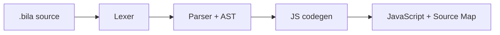

<div align="center">

# 🧭 BilaScript

### An AST-first BilaScript-to-JavaScript compiler

[](https://github.com/webgis-vinhlong/bila/actions/workflows/ci.yml)
[](https://webgis-vinhlong.github.io/bila/)
[](https://nodejs.org/)
[](LICENSE)

[🇻🇳 Tiếng Việt](README.md) · [🇬🇧 English](README.en.md) · [🇨🇳 简体中文](README.zh-CN.md)

[🌐 Open Playground](https://webgis-vinhlong.github.io/bila/) · [🧪 LAB-40](https://webgis-vinhlong.github.io/bila/lab.html) · [📘 AST docs](docs/AST.md) · [🧩 VS Code](docs/VSCODE.md)

</div>

> [!IMPORTANT]
> BilaScript 5 is a **DevKit preview**. It uses a real lexer/parser/AST pipeline, but it does not claim complete ECMAScript or Test262 conformance.

## ✨ What is BilaScript?

BilaScript is an experimental programming language with localized keywords. It compiles to JavaScript for Node.js and browsers. DevKit 5 replaces text/regex substitution with a structured pipeline: tokenization, an ESTree-like AST, JavaScript code generation, diagnostics, and Source Map v3 output.



There is no proprietary runtime wrapper. Browser globals and Web APIs—`document`, `window`, `fetch`, `localStorage`, Canvas, and events—remain ordinary JavaScript APIs.

## 🚀 Quick start

Requires **Node.js 20+**.

```bash
git clone https://github.com/webgis-vinhlong/bila.git
cd bila
npm test
node bin/bila.mjs run examples/basic.bila
```

Compile a file:

```bash
node bin/bila.mjs compile examples/basic.bila -o build/basic.js
```

| Command | Purpose |
|---|---|
| `bila check file.bila` | Validate syntax and print diagnostics |
| `bila ast file.bila` | Print the JSON AST |
| `bila compile file.bila -o file.js` | Emit JavaScript and a v3 source map |
| `bila run file.bila` | Compile and run with Node.js |

## 🧩 Example

```bila
---bila:strict---
haml_sob sum(a: Sob, b: Sob): Sob { trov_ved a + b; }
bilb values: Magz<Sob> = [1, 2];
values.dayq(3);
vil (bilb i = 0; i < values.dof_zail; i++) {
  neub (values[i] > 1) { console.log(values[i]); }
}
console.log(sum(4, 5));
```

Output: `2`, `3`, `9`.

## 🗺️ Core vocabulary

| BilaScript | JavaScript | BilaScript | JavaScript |
|---|---|---|---|
| `haml_sob` | `function` | `bilb` | `var` |
| `neub` / `kac` | `if` / `else` | `vil` | `for` |
| `trogp_ki` | `while` | `trov_ved` | `return` |
| `lopx` / `moix` | `class` / `new` | `thuv` / `chupr_layb` | `try` / `catch` |
| `nemj` / `cujb_cugl` | `throw` / `finally` | `nhapf` / `xadb` | `import` / `export` |
| `dayq` | `push` | `dof_zail` | `length` |
| `ahj_xar` / `locr` | `map` / `filter` | `mony_Tolj` | `Math` |

The complete mappings live in [src/compiler.mjs](src/compiler.mjs).

## 🏗️ Components and status

| Component | Status | Notes |
|---|---:|---|
| Unicode lexer | ✅ | Tokens, locations, strings, regex and template literals |
| Recursive-descent parser | ✅ | Statements, expressions, classes and modules |
| JavaScript code generator | ✅ | BilaScript keyword and alias lowering |
| Source Map v3 | ✅ Preview | Statement-level mappings |
| CLI | ✅ | `check`, `ast`, `compile`, `run` |
| Web playground | ✅ | JS/AST views and time-limited Web Worker execution |
| VS Code Tools | ✅ Preview | Highlighting, snippets, diagnostics, compile/run/debug |
| Full ECMAScript/Test262 | ❌ | Explicitly outside this preview's claims |

## 🧰 VS Code

Install `dist/bilascript-official-tools-0.1.0.vsix` via **Extensions → … → Install from VSIX…**. It provides compile, run, AST inspection and Node source-map debugging commands.

“Official Tools” is the extension identity requested by this project. This local package is **not claimed to be published or verified on the Visual Studio Marketplace**.

## 🧪 Verification

Run `npm run verify`. `src/compiler.mjs` is the single source of truth; `npm run sync` refreshes the extension and browser copies, and CI rejects stale generated files.

## ⚠️ Scope and security

The preview does not fully support JSX, decorators, private class fields, every module/template form, or the full TypeScript grammar. The playground uses a short-lived Web Worker to reduce UI lockups, but neither the playground nor the CLI is a security sandbox for untrusted code. See [SECURITY.md](SECURITY.md).

## 📜 License

Released under the [MIT License](LICENSE). Copyright © 2026 Long Ngo.
