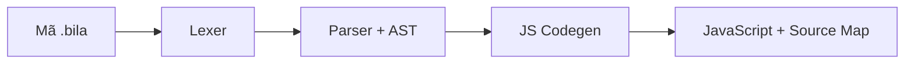

<div align="center">

# 🧭 BilaScript

### Trình biên dịch AST-first từ BilaScript sang JavaScript

[](https://github.com/webgis-vinhlong/bila/actions/workflows/ci.yml)
[](https://webgis-vinhlong.github.io/bila/)
[](https://nodejs.org/)
[](LICENSE)
[](CHANGELOG.md)

[🇻🇳 Tiếng Việt](README.md) · [🇬🇧 English](README.en.md) · [🇨🇳 简体中文](README.zh-CN.md)

[🌐 Mở Playground](https://webgis-vinhlong.github.io/bila/) · [🧪 LAB-40](https://webgis-vinhlong.github.io/bila/lab.html) · [📘 Tài liệu AST](docs/AST.md) · [🧩 VS Code](docs/VSCODE.md)

</div>

> [!IMPORTANT]
> BilaScript 5 hiện là **DevKit preview**. Lõi trình biên dịch dùng lexer/parser/AST thật, nhưng chưa tuyên bố tương thích toàn bộ ECMAScript hay Test262.

## ✨ BilaScript là gì?

BilaScript là ngôn ngữ lập trình thử nghiệm có cú pháp từ khóa bản địa hóa, được biên dịch thành JavaScript để chạy trên Node.js và trình duyệt. Bản DevKit 5 thay cách thay thế chuỗi/regex bằng pipeline có cấu trúc: lexer tạo token, parser dựng AST kiểu ESTree, code generator sinh JavaScript và Source Map v3.



Web API không bị bọc bởi runtime riêng. `document`, `window`, `fetch`, `localStorage`, Canvas và event API vẫn là API JavaScript thông thường của môi trường chạy.

## 🚀 Chạy nhanh

Yêu cầu: **Node.js 20+**.

```bash
git clone https://github.com/webgis-vinhlong/bila.git
cd bila
npm test
node bin/bila.mjs run examples/basic.bila
```

Biên dịch một tệp:

```bash
node bin/bila.mjs compile examples/basic.bila -o build/basic.js
```

| Lệnh | Mục đích |
|---|---|
| `bila check file.bila` | Kiểm tra cú pháp và diagnostics |
| `bila ast file.bila` | Xuất AST dạng JSON |
| `bila compile file.bila -o file.js` | Sinh JavaScript và Source Map v3 |
| `bila run file.bila` | Biên dịch và chạy bằng Node.js |

## 🧩 Ví dụ

```bila
---bila:strict---

haml_sob tong(a: Sob, b: Sob): Sob {
  trov_ved a + b;
}

bilb day_so: Magz<Sob> = [1, 2];
day_so.dayq(3);

vil (bilb i = 0; i < day_so.dof_zail; i++) {
  neub (day_so[i] > 1) {
    console.log(day_so[i]);
  }
}

console.log(tong(4, 5));
```

Kết quả: `2`, `3`, `9`.

## 🗺️ Từ vựng lõi

| BilaScript | JavaScript | BilaScript | JavaScript |
|---|---|---|---|
| `haml_sob` | `function` | `bilb` | `var` |
| `neub` / `kac` | `if` / `else` | `vil` | `for` |
| `trogp_ki` | `while` | `trov_ved` | `return` |
| `lopx` / `moix` | `class` / `new` | `thuv` / `chupr_layb` | `try` / `catch` |
| `nemj` / `cujb_cugl` | `throw` / `finally` | `nhapf` / `xadb` | `import` / `export` |
| `dayq` | `push` | `dof_zail` | `length` |
| `ahj_xar` / `locr` | `map` / `filter` | `mony_Tolj` | `Math` |

Danh sách đầy đủ nằm trong `KEYWORDS`, `GLOBAL_ALIASES` và `MEMBER_ALIASES` tại [src/compiler.mjs](src/compiler.mjs).

## 🏗️ Thành phần

| Thành phần | Trạng thái | Mô tả |
|---|---:|---|
| Lexer Unicode | ✅ | Token, vị trí dòng/cột, chuỗi, regex, template literal |
| Recursive-descent parser | ✅ | AST cho câu lệnh, biểu thức, class và module |
| JS code generator | ✅ | Hạ từ khóa/alias BilaScript sang JavaScript |
| Source Map v3 | ✅ Preview | Ánh xạ cấp câu lệnh |
| CLI | ✅ | `check`, `ast`, `compile`, `run` |
| Playground Web | ✅ | Biên dịch, xem JS/AST, chạy trong Web Worker có giới hạn thời gian |
| VS Code Tools | ✅ Preview | Tô màu, snippets, diagnostics, compile/run/debug |
| ECMAScript/Test262 đầy đủ | ❌ | Không phải tuyên bố của bản preview |

## 🧰 VS Code

Cài `dist/bilascript-official-tools-0.1.0.vsix` bằng **Extensions → … → Install from VSIX…**.

- `BilaScript: Compile current file`
- `BilaScript: Run current file`
- `BilaScript: Show AST`
- `BilaScript: Debug current file`

Tên “Official Tools” là danh tính extension của dự án; gói cục bộ này **chưa được tuyên bố là đã xuất bản hoặc xác minh trên Visual Studio Marketplace**.

## 🧪 Kiểm thử và đồng bộ

```bash
npm run verify
```

`src/compiler.mjs` là nguồn chuẩn duy nhất. `npm run sync` đồng bộ lõi sang extension và playground; CI sẽ báo lỗi nếu các bản sao bị lệch.

## 📁 Cấu trúc

```text
bin/                 CLI
src/                 lõi compiler
test/                kiểm thử hồi quy
examples/            ví dụ Node và Web
site/                GitHub Pages + playground
vscode-extension/    mã nguồn extension VS Code
docs/                tài liệu kỹ thuật
dist/                gói preview dựng sẵn
```

## ⚠️ Phạm vi và an toàn

- Chưa hỗ trợ đầy đủ JSX, decorator, private class field, mọi biến thể module/template hay toàn bộ ngữ pháp TypeScript.
- Playground chỉ giảm rủi ro treo giao diện bằng Web Worker và timeout; compiler/CLI **không phải sandbox bảo mật** cho mã không tin cậy.
- Xem [SECURITY.md](SECURITY.md) và [CONTRIBUTING.md](CONTRIBUTING.md) trước khi báo lỗi hoặc đóng góp.

## 📜 Giấy phép

Phát hành theo [MIT License](LICENSE). Copyright © 2026 Long Ngo.

---

<div align="center">Được phát triển như một bộ công cụ ngôn ngữ mở, có thể kiểm thử và cải tiến theo từng bước.</div>
