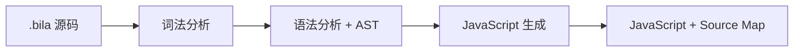

<div align="center">

# 🧭 BilaScript

### 基于 AST 的 BilaScript → JavaScript 编译器

[](https://github.com/webgis-vinhlong/bila/actions/workflows/ci.yml)
[](https://webgis-vinhlong.github.io/bila/)
[](https://nodejs.org/)
[](LICENSE)

[🇻🇳 Tiếng Việt](README.md) · [🇬🇧 English](README.en.md) · [🇨🇳 简体中文](README.zh-CN.md)

[🌐 打开 Playground](https://webgis-vinhlong.github.io/bila/) · [🧪 LAB-40](https://webgis-vinhlong.github.io/bila/lab.html) · [📘 AST 文档](docs/AST.md) · [🧩 VS Code](docs/VSCODE.md)

</div>

> [!IMPORTANT]
> BilaScript 5 目前是 **DevKit 预览版**。它使用真正的词法分析器、语法分析器和 AST，但不声称完整兼容 ECMAScript 或 Test262。

## ✨ 什么是 BilaScript？

BilaScript 是一种使用本地化关键字的实验性编程语言，可编译为 JavaScript 并在 Node.js 与浏览器中运行。DevKit 5 不再依赖文本或正则替换，而是采用结构化流程：分词、构建类似 ESTree 的 AST、生成 JavaScript、输出诊断信息与 Source Map v3。



项目没有专有运行时包装器。`document`、`window`、`fetch`、`localStorage`、Canvas 与事件 API 仍是运行环境中的普通 JavaScript API。

## 🚀 快速开始

需要 **Node.js 20+**。

```bash
git clone https://github.com/webgis-vinhlong/bila.git
cd bila
npm test
node bin/bila.mjs run examples/basic.bila
```

编译文件：

```bash
node bin/bila.mjs compile examples/basic.bila -o build/basic.js
```

| 命令 | 用途 |
|---|---|
| `bila check file.bila` | 检查语法并输出诊断信息 |
| `bila ast file.bila` | 输出 JSON AST |
| `bila compile file.bila -o file.js` | 生成 JavaScript 与 Source Map v3 |
| `bila run file.bila` | 使用 Node.js 编译并运行 |

## 🧩 示例

```bila
---bila:strict---
haml_sob tong(a: Sob, b: Sob): Sob { trov_ved a + b; }
bilb day_so: Magz<Sob> = [1, 2];
day_so.dayq(3);
vil (bilb i = 0; i < day_so.dof_zail; i++) {
  neub (day_so[i] > 1) { console.log(day_so[i]); }
}
console.log(tong(4, 5));
```

输出：`2`、`3`、`9`。

## 🗺️ 核心词汇

| BilaScript | JavaScript | BilaScript | JavaScript |
|---|---|---|---|
| `haml_sob` | `function` | `bilb` | `var` |
| `neub` / `kac` | `if` / `else` | `vil` | `for` |
| `trogp_ki` | `while` | `trov_ved` | `return` |
| `lopx` / `moix` | `class` / `new` | `thuv` / `chupr_layb` | `try` / `catch` |
| `nemj` / `cujb_cugl` | `throw` / `finally` | `nhapf` / `xadb` | `import` / `export` |
| `dayq` | `push` | `dof_zail` | `length` |
| `ahj_xar` / `locr` | `map` / `filter` | `mony_Tolj` | `Math` |

完整映射位于 [src/compiler.mjs](src/compiler.mjs)。

## 🏗️ 组件与状态

| 组件 | 状态 | 说明 |
|---|---:|---|
| Unicode 词法分析器 | ✅ | Token、行列位置、字符串、正则与模板字面量 |
| 递归下降语法分析器 | ✅ | 语句、表达式、类与模块 |
| JavaScript 代码生成器 | ✅ | 转换 BilaScript 关键字与别名 |
| Source Map v3 | ✅ 预览 | 语句级映射 |
| CLI | ✅ | `check`、`ast`、`compile`、`run` |
| Web Playground | ✅ | 查看 JS/AST，在限时 Web Worker 中运行 |
| VS Code Tools | ✅ 预览 | 高亮、代码片段、诊断、编译/运行/调试 |
| 完整 ECMAScript/Test262 | ❌ | 不属于本预览版的声明范围 |

## 🧰 VS Code

通过 **Extensions → … → Install from VSIX…** 安装 `dist/bilascript-official-tools-0.1.0.vsix`，即可使用编译、运行、AST 查看和基于 Source Map 的 Node 调试功能。

“Official Tools”是本项目要求的扩展标识；此本地安装包**不代表已经在 Visual Studio Marketplace 发布或通过验证**。

## 🧪 验证与同步

运行 `npm run verify`。`src/compiler.mjs` 是唯一事实来源；`npm run sync` 会更新 VS Code 扩展和浏览器副本，CI 会拒绝不同步的生成文件。

## ⚠️ 范围与安全

预览版尚未完整支持 JSX、装饰器、私有类字段、所有模块/模板形式或完整 TypeScript 语法。Playground 使用短生命周期 Web Worker 来降低界面卡死风险，但 Playground 与 CLI 都不是运行不可信代码的安全沙箱。请参阅 [SECURITY.md](SECURITY.md)。

## 📜 许可证

采用 [MIT License](LICENSE) 发布。Copyright © 2026 Long Ngo。
